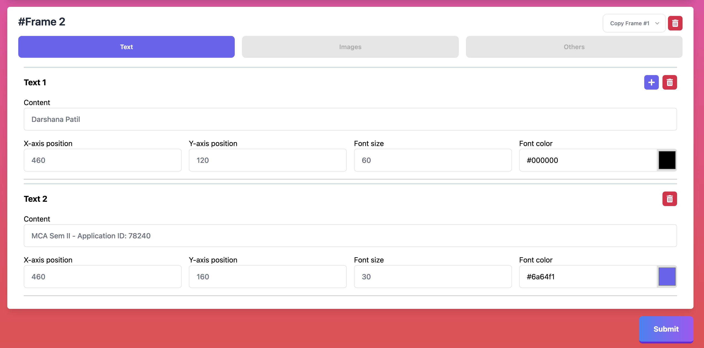

# Tech stack

- ##### Frontend - `ReactJS`
- ##### Backend - `NodeJs`
- ##### Database - `MongoDB`
- ##### Video processing - `FFMPEG`

## Run the application

In the project directory, you can run:

### `./start.sh`

###### Note: Set the permission to run by `chmod +x start.sh`

Runs the app in the development mode.\
Open [http://localhost:3000](http://localhost:3000) to view frontend in your browser.
[http://localhost:3001](http://localhost:3001) is used to serve backend.

# UI

_Desktop App intro_

_Mobile App intro_

_Desktop frame form_

_Mobile frame texts tab_

_Mobile frame images tab_

_Mobile frame others tab_

_Copy from previous frames option_

_Frame 2_

_Video in progress status_

_Video failed status_

_Video completed status_

_Download as zip option_

_Text to video converted_

_Video duration matches audio duration_
